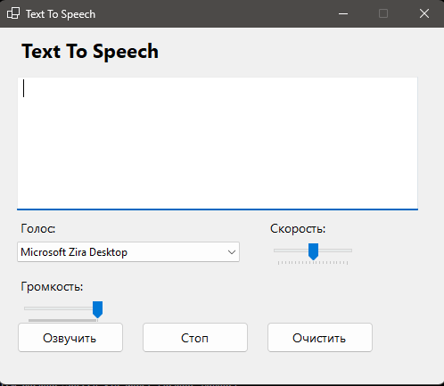

# Text To Speech App (WinForms)
---
- Приложение позволяющее озвучивать текст с помощью встроенного механизма синтеза речи Windows
---
- An application that allows you to voice text using the built-in Windows speech synthesis engine
---
## О приложении:
- Озвучивание текста в реальном времени  
- Регулировка громкости  
- Регулировка скорости речи  
- Выбор доступных голосов  
- Остановка речи в любой момент  
- Очистка текста одной кнопкой  
- Лёгкий, быстрый и полностью офлайн
---
## About the app:
- Real-time text-to-speech  
- Volume control  
- Speech speed adjustment  
- Selection of available voices  
- Stop speech at any time  
- Clear text with one button  
- Easy, fast and completely offline
---
## NuGet Packages:
- System.Speech
---
## Как установить:
1. Склонируйте репозиторий или скачайте ZIP архив и распакуйте его
2. Откройте проект в Visual Studio
3. Скачайте пакет System.Speech через NuGet Package Manager
4. Соберите проект и запустите приложение
---
## How to install:
1. Clone the repository or download the ZIP archive and unzip it
2. Open the project in Visual Studio
3. Download the System package.Speech via NuGet Package Manager
4. Assemble the project and launch the application
---

---
